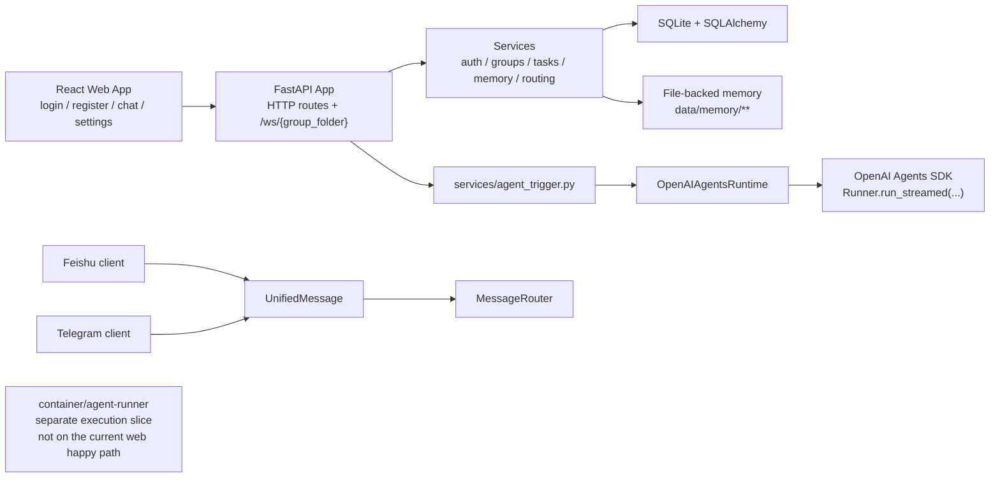
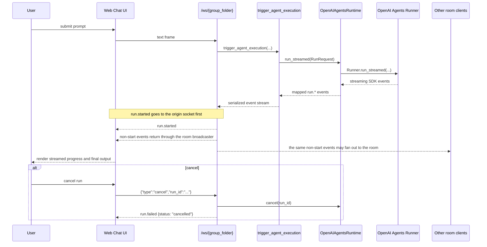
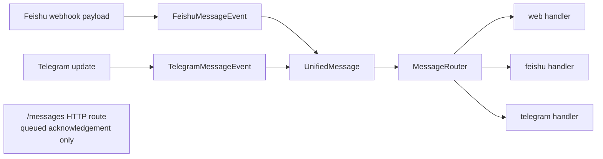

# Portex

[中文](README.zh-CN.md) | **English**

Portex is a remote, multi-user agent gateway built with Python, FastAPI, React, and the OpenAI Agents SDK.

`Portex = Portal + Codex.` The project aims to become a portal to Codex: a shared entrypoint where teams can trigger, observe, and manage Codex-style agent workflows from the web today and from chat platforms over time.

## Why Portex

- Turn agent execution into a shared service instead of a single-user local workflow.
- Provide a web entrypoint now, with clear Feishu and Telegram integration boundaries already in place.
- Keep orchestration explicit: auth, groups, tasks, memory, and routing live outside the core agent loop.
- Leave room for isolated execution slices such as container-backed runners and runner-side tools.

## What Works Today

- [x] React web UI plus FastAPI backend entrypoints
- [x] WebSocket run / stream / cancel flow for browser chat
- [x] Multi-user auth, invite codes, group membership, and RBAC
- [x] Task scheduling, CRUD APIs, and in-memory run logs
- [x] File-backed user/group memory plus runner-side memory tools
- [x] Feishu foundations: auth, webhook verification/decrypt, normalization, and a minimal send contract
- [x] Telegram foundations: polling, normalization, and Markdown conversion
- [x] Unified message DTO and a minimal cross-channel routing boundary
- [x] Local CI workflow, regression tests, security scan, dependency audit, and baseline HTTP security headers

## What's Next

- [ ] End-to-end IM delivery: inbound message -> agent run -> outbound response
- [ ] Stronger persistence for users, tasks, logs, and memory beyond the current minimal stores
- [ ] Verified Docker runtime and release-image build on a machine with Docker available
- [ ] Production hardening for deployment, reverse proxy, secret handling, and browser security policy
- [ ] Richer operational visibility and administration flows for long-running team use

## Architecture

### System Overview



### Web Run / Stream / Cancel Flow



### Current IM Normalization Boundary



## Quick Start

### Backend

```bash
python -m venv .venv
source .venv/bin/activate
pip install -e ".[dev]"
.venv/bin/python scripts/init_db.py
.venv/bin/python -m uvicorn app.main:app --host 127.0.0.1 --port 8000 --reload
```

### Frontend

```bash
cd web
npm ci
npm run dev -- --host 127.0.0.1 --port 5173
```

After startup:

- backend: `http://127.0.0.1:8000`
- frontend: `http://127.0.0.1:5173`
- API docs: `http://127.0.0.1:8000/docs`

For deployment-oriented setup, see [`docs/deployment.md`](docs/deployment.md).

## Developer Workflow

```bash
# full backend regression
.venv/bin/pytest -o addopts='' -q

# focused integration slice
.venv/bin/pytest -o addopts='' tests/integration/test_api.py tests/integration/test_websocket.py -q

# security checks
.venv/bin/python scripts/security_scan.py
.venv/bin/python scripts/dependency_audit.py

# backend lint
.venv/bin/ruff check .

# frontend checks
cd web && npm run lint
cd web && npm run build

# release-image build entrypoint
.venv/bin/python scripts/build_docker.py --tag portex:v1.0.0
```

## Repository Map

- `app/`: FastAPI app, HTTP routes, middleware, and WebSocket entrypoints
- `domain/`: schemas, permissions, and SQLAlchemy models
- `infra/`: database wiring, runtime adapters, execution backends, and IM clients
- `services/`: auth, scheduling, memory, routing, and orchestration services
- `container/agent-runner/`: runner-side execution and tool wrappers
- `web/`: React + Vite frontend
- `tests/`: backend, integration, runner, and frontend-adjacent verification
- `docs/`: deployment notes, plans, and contributor handoff material
- `scripts/`: DB initialization, security checks, release helpers, and project utilities

## Current Boundaries

- Persistence: several user, task, log, and memory paths still rely on minimal in-memory or file-backed implementations.
- IM runtime: Feishu and Telegram foundations exist, but the full inbound-to-agent-to-outbound delivery chain is not wired end to end.
- Message routing: `UnifiedMessage` and `MessageRouter` define the current routing boundary, while `/messages` still returns a queued acknowledgement only.
- Execution: the repo contains a separate `container/agent-runner` slice, but the current browser WebSocket happy path runs through `OpenAIAgentsRuntime`.
- Docker verification: the root release-image build path exists, but a fresh `docker build` still needs to be verified on a machine where Docker is available.
- Security and deployment: baseline scans, dependency audit, and HTTP security headers are in place, but this is not yet a fully hardened production deployment story.

## Documentation

- [`README.zh-CN.md`](README.zh-CN.md): Chinese counterpart of this README
- [`docs/deployment.md`](docs/deployment.md): current deployment guide and environment notes
- FastAPI API docs: available locally at `http://127.0.0.1:8000/docs`
- [`docs/progress.md`](docs/progress.md): restart-oriented current implementation status for contributors
- [`docs/TODO.md`](docs/TODO.md): internal implementation checklist and milestone planning
- [`AGENTS.md`](AGENTS.md): repository workflow constraints for Codex sessions
