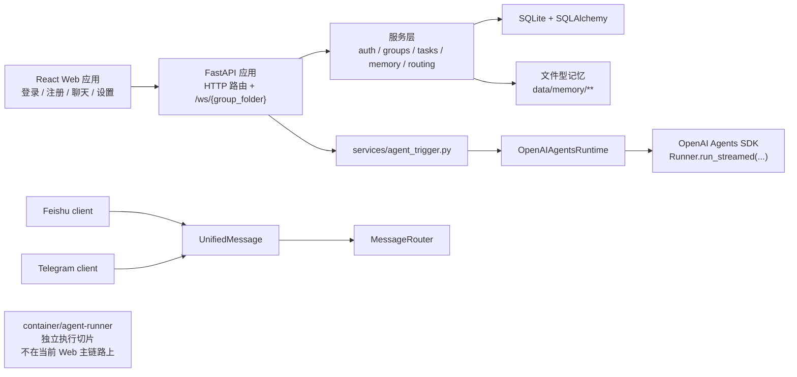
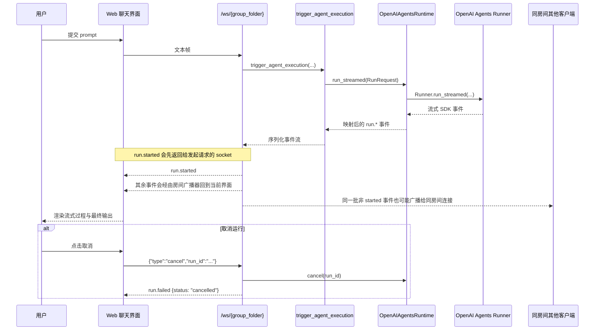
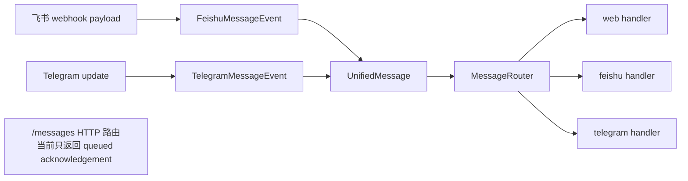

# Portex

<p align="center">
  
</p>

**中文** | [English](README.md)

Portex 是一个基于 Python、FastAPI、React 和 OpenAI Agents SDK 构建的多用户远程智能体入口服务。

`Portex = Portal + Codex。` 这个项目的目标，是成为 Codex 的传送门：让团队可以先通过 Web 统一触发、观察和管理 Codex 风格的智能体工作流，并逐步扩展到聊天平台场景。

## 为什么是 Portex

- 把智能体执行从“单人本地工具”提升为“团队共享服务”。
- 先提供 Web 入口，同时为飞书和 Telegram 预留清晰的集成边界。
- 让编排层保持显式：认证、群组、任务、记忆、消息路由都放在核心 agent loop 之外。
- 为容器化执行、runner 侧工具等隔离能力保留演进空间。

## 当前已支持

- [x] React Web UI 与 FastAPI 后端入口
- [x] 面向浏览器聊天的 WebSocket 运行 / 流式输出 / 取消链路
- [x] 多用户认证、邀请码、群组成员管理与 RBAC
- [x] 任务调度、任务 CRUD API 与内存态运行日志
- [x] 文件型用户 / 群组记忆，以及 runner 侧 memory tools
- [x] 飞书基础能力：鉴权、Webhook 验签 / 解密、消息归一化与最小发送契约
- [x] Telegram 基础能力：轮询、消息归一化与 Markdown 转换
- [x] 统一消息 DTO 与最小跨通道路由边界
- [x] 本地 CI 工作流、回归测试、安全扫描、依赖审计与基础 HTTP 安全头

## 接下来要做什么

- [ ] 打通端到端 IM 投递链路：收到消息 -> 触发 agent -> 回发响应
- [ ] 为用户、任务、日志与记忆补齐比当前最小实现更稳固的持久化能力
- [ ] 在具备 Docker 的机器上完成运行时与发布镜像构建验证
- [ ] 继续加强部署、反向代理、密钥管理与浏览器安全策略
- [ ] 为长期团队使用补齐更完整的运维可观测性和管理能力

## 架构

### 系统总览



### Web 运行 / 流式输出 / 取消流程



### 当前 IM 归一化与路由边界



## 快速开始

### Backend

```bash
python -m venv .venv
source .venv/bin/activate
pip install -e ".[dev]"
.venv/bin/python scripts/init_db.py
.venv/bin/python -m uvicorn app.main:app --host 127.0.0.1 --port 8000 --reload
```

### Frontend

```bash
cd web
npm ci
npm run dev -- --host 127.0.0.1 --port 5173
```

启动后可访问：

- backend: `http://127.0.0.1:8000`
- frontend: `http://127.0.0.1:5173`
- API 文档: `http://127.0.0.1:8000/docs`

如果你更关注部署方式，请继续阅读 [`docs/deployment.md`](docs/deployment.md)。

## 开发工作流

```bash
# 后端全量回归
.venv/bin/pytest -o addopts='' -q

# 集成测试切片
.venv/bin/pytest -o addopts='' tests/integration/test_api.py tests/integration/test_websocket.py -q

# 安全检查
.venv/bin/python scripts/security_scan.py
.venv/bin/python scripts/dependency_audit.py

# 后端 lint
.venv/bin/ruff check .

# 前端检查
cd web && npm run lint
cd web && npm run build

# 发布镜像构建入口
.venv/bin/python scripts/build_docker.py --tag portex:v1.0.0
```

## 仓库结构

- `assets/`: 共享静态文档资源，例如项目 logo
- `app/`: FastAPI 应用、HTTP 路由、中间件与 WebSocket 入口
- `domain/`: schema、权限定义与 SQLAlchemy 模型
- `infra/`: 数据库装配、runtime 适配层、执行后端与 IM 客户端
- `services/`: 认证、调度、记忆、路由与编排服务
- `container/agent-runner/`: runner 侧执行逻辑与工具封装
- `web/`: React + Vite 前端
- `tests/`: 后端、集成、runner 与相关验证测试
- `docs/`: 部署文档、计划文档与贡献者交接材料
- `scripts/`: 数据库初始化、安全检查、发布辅助脚本与项目工具

## 当前边界

- 持久化：若干用户、任务、日志与记忆能力仍然基于最小的内存态或文件型实现。
- IM 运行链：飞书和 Telegram 基础能力已就位，但“入站消息 -> agent 运行 -> 出站回复”尚未完全打通。
- 消息路由：`UnifiedMessage` 与 `MessageRouter` 已定义当前路由边界，而 `/messages` 仍只是一个 queued acknowledgement 占位接口。
- 执行路径：仓库里已经有独立的 `container/agent-runner` 切片，但当前浏览器 WebSocket 主链路仍直接走 `OpenAIAgentsRuntime`。
- Docker 验证：根目录发布镜像构建入口已经存在，但仍需要在装有 Docker 的机器上完成 fresh `docker build` 验证。
- 安全与部署：基础扫描、依赖审计与 HTTP 安全头已经具备，但这还不是完全 hardened 的生产部署方案。

## 文档导航

- [`README.md`](README.md): 英文主 README
- [`docs/deployment.md`](docs/deployment.md): 当前部署说明与环境要求
- FastAPI API 文档: 本地启动后访问 `http://127.0.0.1:8000/docs`
- [`docs/progress.md`](docs/progress.md): 面向贡献者的重启续做状态
- [`docs/TODO.md`](docs/TODO.md): 内部实现清单与阶段规划
- [`AGENTS.md`](AGENTS.md): Codex 协作工作流约束
